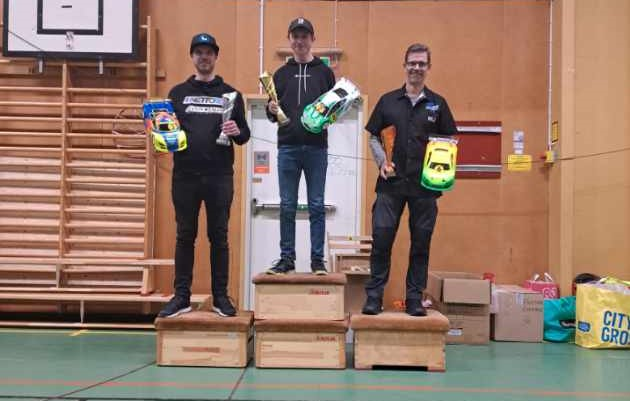

# Touring Stock 13,5T

| Ranking | Namn                    | Klubb                      |  #1 |  #2 |  #3 |  #4 |  #5 | Final | Tot |
| ------- | ----------------------- | -------------------------- | --- | --- | --- | --- | --- | ----- | --- |
| 1       | __Hampus Broman__           | MK Eskil                   | 52* | 48  | 52* | 48  |     | 60    | 212 |
| 2       | __Per Lindqvist__           | Karlstad Miniracing        | 48  | 46  | 44  |     |     | 54    | 192 |
| 3       | __Nils Arback__             | MHF Skarpnäck              |     | 39  | 40  | 40  |     | 49    | 168 |
| 4       | Alexander Andersson     | Miracl                     |     | 52* |     | 42  |     | 59*   | 153 |
| 5       | Alexander Johansson (J) | Skövde MK                  | 44  | 41  |     | 46  |     |       | 131 |
| 6       | Kim Lindgren            | Borås MRK                  |     | 34  |     | 41  |     | 51    | 126 |
| 7       | Patrik Lagerlöf         | Skövde MK                  | 42  | 38  |     | 35  |     |       | 115 |
| 8       | Michael Hahne           | MHF Skarpnäck              |     |     |     | 39  |     | 52    | 91  |
| 9       | Rasmus Karlsson         | Örebro RBC                 | 46  | 44  |     |     |     |       | 90  |
| 10      | Massimo Salvini         | Karlskrona Miniracingklubb |     |     |     | 37  |     | 50    | 87  |
| 11      | Claes Öman              | Lidköpings R/C klubb       | 37  | 30  |     |     |     |       | 67  |
| 12      | Conny Nilsson           | RBN Norrköping             | 36  | 31  |     |     |     |       | 67  |
| 13      | Tommy Alvarsson         | Lidköpings R/C klubb       |     | 36  |     | 31  |     |       | 67  |
| 14      | Jacob Fridh             | Lidköpings R/C klubb       |     | 35  |     | 32  |     |       | 67  |
| 15      | Günter von Elling       | Lidköpings R/C klubb       |     | 33  |     | 33  |     |       | 66  |
| 16      | Viktor Wilck            | Karlskrona Miniracingklubb |     |     |     | 52* |     |       | 52  |
| 17      | Alexander Wågstedt      | Skellefteå MS              |     |     | 48  |     |     |       | 48  |
| 18      | Albin Kihlgren          | Skellefteå MS              |     |     | 46  |     |     |       | 46  |
| 19      | Andreas Johansson       | Skövde MK                  |     |     |     | 44  |     |       | 44  |
| 20      | David Andersson         | SMK Trollhättan            | 43  |     |     |     |     |       | 43  |
| 21      | Andreas Gillblad        | Karlstad Miniracing        |     | 43  |     |     |     |       | 43  |
| 22      | Simon Frederiksen       | JMK                        |     |     | 43  |     |     |       | 43  |
| 23      | Björn Lantz             | MHF Skarpnäck              |     |     |     | 43  |     |       | 43  |
| 24      | Fredrik Loiske          | Karlstad Miniracing        |     | 42  |     |     |     |       | 42  |
| 25      | Kenth Berthilsson       | Luleå RC Klubb             |     |     | 42  |     |     |       | 42  |
| 26      | Anders Stridsberg       | Kils MK Bil                | 41  |     |     |     |     |       | 41  |
| 27      | Jörgen Wahlberg         | Umeå AK                    |     |     | 41  |     |     |       | 41  |
| 28      | Daniel Johansson        | SMK Trollhättan            | 40  |     |     |     |     |       | 40  |
| 29      | Christoffer Hallborg    | Lidköpings R/C klubb       |     | 40  |     |     |     |       | 40  |
| 30      | Andreas Bohlander       | Öckerö Rc Klubn            | 39  |     |     |     |     |       | 39  |
| 31      | Valdemar Vikström       | Luleå RC Klubb             |     |     | 39  |     |     |       | 39  |
| 32      | Henrik Magnusson        | Öckerö Rc Klubb            | 38  |     |     |     |     |       | 38  |
| 33      | Dennis Sjölander        | JMK                        |     |     | 38  |     |     |       | 38  |
| 34      | Jose Castro             | MHF Skarpnäck              |     |     |     | 38  |     |       | 38  |
| 35      | Peter Sundberg          | Skövde MK                  |     | 37  |     |     |     |       | 37  |
| 36      | Hugo Nordström          | AMF Årsunda                |     |     |     | 36  |     |       | 36  |
| 37      | Marc Grevler            | Skövde MK                  | 35  |     |     |     |     |       | 35  |
| 38      | Henrik Nordström        | AMF Årsunda                |     |     |     | 34  |     |       | 34  |
| 39      | Isac Billred            | Vetlanda RRC               |     | 32  |     |     |     |       | 32  |
| 40      | Peter Edlund            | Lidköpings R/C klubb       |     |     |     | 30  |     |       | 30  |

(*) Markerar den förare som fick två extra poäng för TQ  
(J) Markerar junior
