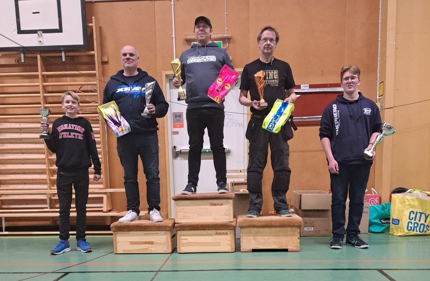

# 1:12 Track 13,5T

| Ranking | Namn                | Klubb                     |  #1 |  #2 |  #3 |  #4 |  #5 | Final | Tot |
| ------- | ------------------- | ------------------------- | --- | --- | --- | --- | --- | ----- | --- |
| 1       | __Alexander Andersson__ | Miracl                    | 52* | 52* |     | 48  |     | 59*   | 211 |
| 2       | __Markus Andreasson__   | MHF Skarpnäck             | 48  | 48  | 50* | 52* |     | 54    | 204 |
| 3       | __Magnus Hedlund__      | Västerås MS               | 46  | 46  | 46  | 46  |     | 60    | 198 |
| 4       | __Albin Piispanen (J)__ | Västerås MS               | 43  | 43  | 44  | 43  |     | 52    | 182 |
| 5       | Jörgen Elwing       | MHF Skarpnäck             | 41  | 39  |     | 41  |     | 49    | 170 |
| 6       | Jörgen Gustafsson   | Bofors MRK                | 40  | 38  | 39  |     |     | 48    | 165 |
| 7       | __Emanuel Myhrman (J)__ | Bofors MRK                | 39  | 37  | 38  |     |     | 47    | 161 |
| 8       | Mickael Brandt      | UppsalaRC                 | 44  | 44  | 50  | 44  |     |       | 138 |
| 9       | Lars Petterson      | MK Eskil                  |     |     |     | 40  |     | 50    | 90  |
| 10      | Björn Håkansson     | Karlstad miniracing klubb | 42  | 40  |     |     |     |       | 82  |
| 11      | Mackan Göransson    | Västerås MS               |     | 41  |     | 39  |     |       | 80  |
| 12      | Lars Hägerman       |                           |     |     |     |     |     | 51    | 51  |
| 13      | Simon Frederiksen   | JMK                       |     |     | 43  |     |     |       | 43  |
| 14      | Göran Persson       | Örebro RBC                |     | 42  |     |     |     |       | 42  |
| 15      | Daniel Hallgren     | SMK DALA                  |     |     | 42  |     |     |       | 42  |
| 16      | Lars Andersson      | Västerås MS               |     |     |     | 42  |     |       | 42  |
| 17      | Jörgen Wahlberg     | Umeå AK                   |     |     | 41  |     |     |       | 41  |
| 18      | Kenth Berthilsson   | Luleå RC Klubb            |     |     | 40  |     |     |       | 40  |

(*) Markerar den förare som fick två extra poäng för TQ  
(J) Markerar junior
.
